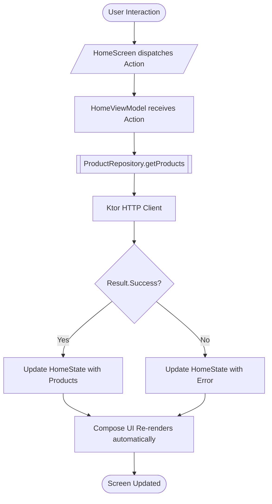

<div align="center">

# 📖 TemplateKMP — Developer Guide

**A comprehensive, step-by-step developer guide: from environment setup to production deployment**

</div>

---

## 📑 Table of Contents

1. [Environment Setup](#1-environment-setup)
2. [Cloning & Running the Project](#2-cloning--running-the-project)
3. [Understanding Project Architecture](#3-understanding-project-architecture)
4. [Understanding Convention Plugins](#4-understanding-convention-plugins)
5. [Understanding Core Modules](#5-understanding-core-modules)
6. [Understanding Feature Modules](#6-understanding-feature-modules)
7. [The MVI (Model-View-Intent) Pattern](#7-the-mvi-model-view-intent-pattern)
8. [Dependency Injection with Koin](#8-dependency-injection-with-koin)
9. [Type-Safe Navigation](#9-type-safe-navigation)
10. [Networking with Ktor](#10-networking-with-ktor)
11. [Tutorial: Creating a New Feature Module](#11-tutorial-creating-a-new-feature-module)
12. [Testing Infrastructure & Quality Gate](#12-testing-infrastructure--quality-gate)
13. [BuildKonfig & Secrets Management](#13-buildkonfig--secrets-management)
14. [Running on Every Platform](#14-running-on-every-platform)
15. [Production Readiness](#15-production-readiness)
16. [Troubleshooting Guide](#16-troubleshooting-guide)
17. [Conventions, Best Practices & AI Agent Lifecycle](#17-conventions-best-practices--ai-agent-lifecycle)

---

## 1. Environment Setup

### 1.1 Required Software

| Software | Minimum Version | Notes |
|----------|-----------------|-------|
| **Android Studio** | Ladybug / Meerkat (2024.2+) | Primary IDE; includes KMP plugin |
| **AGP (Android Gradle Plugin)** | 9.3.0 | Modern Android application & KMP library build conventions |
| **Gradle** | 9.5.0 | Build orchestration tool |
| **JDK** | 17+ | Required for Gradle 9.x and Kotlin 2.3 compilation |
| **Xcode** | 15+ | macOS only; required for compiling and running iOS targets |
| **Maestro** | 2.9+ | Automated UI & E2E Testing CLI for AI agents and CI/CD pipelines |
| **Git** | Any recent version | Version control system |

### 1.2 Step-by-Step Installation

#### Android Studio:
1. Download from [developer.android.com/studio](https://developer.android.com/studio).
2. Install and launch Android Studio.
3. Verify that the **Kotlin Multiplatform** plugin is active:
   - Navigate to `Settings` (or `Preferences` on macOS) → `Plugins` → search for **Kotlin Multiplatform** → Ensure it is enabled.
4. Install Android SDK (API Level 36 / 37) via `Settings` → `Languages & Frameworks` → `Android SDK`.

#### JDK 17+:
```bash
# macOS (via Homebrew)
brew install openjdk@17

# Verify installation
java -version
# Expected output: openjdk version "17.x.x" (or higher)
```

#### Xcode (macOS only):
```bash
# Install Command Line Tools
xcode-select --install

# Launch Xcode at least once to accept terms & licenses
open -a Xcode

# Verify CLI tools
xcodebuild -version
```

#### Maestro CLI:
```bash
# Install Maestro CLI for automated UI testing
curl -fsSL "https://get.maestro.mobile.dev" | bash

# Verify installation
maestro --version
```

### 1.3 Environment Verification Checklist

Run this checklist in your terminal before building:

```bash
# ✅ Check JDK
java -version

# ✅ Check Xcode (macOS only)
xcodebuild -version

# ✅ Check Git
git --version

# ✅ Check Maestro
maestro --version
```

---

## 2. Cloning & Running the Project

> 🧙 **Quick Start with [GreenWizard](https://kmp.libstudio.my.id/)**
> Generate this template with your custom **Project Name** and **Package ID** — without manual renaming. Enter your details on the web portal and download your ready-to-run codebase.
>
> If you generated the project using GreenWizard, you can skip directly to **[Section 2.2](#22-setup-localproperties)**.

### 2.1 Clone Repository (Manual)

```bash
git clone https://github.com/firdaus1453/TemplateKMP.git
cd TemplateKMP
```

### 2.2 Setup `local.properties`

This file contains local environment configurations and secrets that must **never** be committed to version control.

```bash
# Copy from the provided template
cp local.properties.example local.properties
```

Open `local.properties` in your editor and configure your environment:

```properties
# Path to your Android SDK
sdk.dir=/Users/YOUR_USERNAME/Library/Android/sdk

# API Configuration
API_BASE_URL=https://dummyjson.com
```

> ⚠️ **IMPORTANT:** `local.properties` is registered in `.gitignore`. Never commit this file or any production credentials.

### 2.3 Sync & Build

```bash
# Open the project in Android Studio, then click "Sync Project with Gradle Files"
# Or trigger compilation via terminal:
./gradlew assemble
```

> 💡 **First Build Note:** The initial build may take between 5 to 15 minutes as Gradle downloads dependencies and compiles native Kotlin/Native metadata.

### 2.4 Running the Application

```bash
# Android (ensure an emulator is booted or a physical device is connected)
./gradlew :androidApp:assembleDebug
# Or click the ▶ Run button in Android Studio selecting androidApp

# Desktop (JVM window)
./gradlew :composeApp:run

# iOS (see details in Section 14)
```

---

## 3. Understanding Project Architecture

### 3.1 High-Level Layout

This repository aligns with JetBrains' **New KMP Default Project Structure** and **AGP 9.3**:

```
TemplateKMP/
├── 🧠 .agents/                        # 15 Clean Architecture skills & Unified Development Lifecycle
│   ├── AGENTS.md                      # AI agent workflow disciplines & quality gates
│   └── skills/                        # kmp-architecture, kmp-testing, kmp-data, kmp-di, etc.
├── 🔧 build-logic/convention/         # Reusable Gradle convention plugins (AGP 9.3 + CMP 1.12.0)
├── 📱 androidApp/                      # Standalone Android Application Entry Point (AGP 9.3 application)
├── 📱 composeApp/                      # Composition root & Shared UI Library (KMP Library)
├── 🤖 .maestro/                        # Maestro UI automated test flows for AI/CI
│   ├── config.yaml
│   └── flows/                         # 01_app_launch to 08_full_e2e_suite
├── 📜 scripts/run_maestro_tests.sh    # One-click automated Maestro test runner for AI
├── 🏗️ core/
│   ├── domain/                         # Pure Kotlin: Result<D, E>, DataError, interfaces
│   ├── data/                           # Ktor HttpClientFactory, DataStore, SessionStorage
│   ├── presentation/                   # UiText, ObserveAsEvents, shared UI utilities
│   └── designsystem/                   # AppTheme, Colors, Typography, reusable UI components
├── 🧩 feature/
│   ├── auth/        (domain, presentation)
│   ├── home/        (domain, data, presentation)
│   ├── profile/     (domain, data, presentation)
│   ├── settings/    (domain, data, presentation)
│   ├── search/      (domain, data, presentation)
│   ├── notifications/ (domain, presentation)
│   └── media/       (domain, presentation)
├── 📄 gradle/libs.versions.toml       # Centralized Version Catalog
└── ⚙️ settings.gradle.kts             # Module declarations
```

### 3.2 What is the "Composition Root"?

`composeApp` serves as the **composition root** of the application. It connects modular layers into a cohesive application runtime:

- ✅ Initializes **Koin Dependency Injection** (`appModule`)
- ✅ Configures **NavHost** and cross-feature routing
- ✅ Provides platform entry points (iOS `MainViewController`, Desktop `main()`, shared Compose content)
- ✅ Aggregates feature presentation modules into the application UI

Meanwhile, `androidApp` acts as the pure Android application entry point (holding `MainActivity` and `AndroidManifest.xml`), utilizing modern AGP 9.3 application conventions and delegating shared UI rendering to `composeApp`.

### 3.3 Dependency Rules & Boundaries

```
androidApp → composeApp
composeApp → core/* + feature/*/
feature/*/presentation → feature/*/domain + core/presentation + core/designsystem
feature/*/data → feature/*/domain + core/domain + core/data
core/data → core/domain
core/presentation → core/domain + core/designsystem
```

#### Layer Access Matrix:

| Layer | Can Access | CANNOT Access |
|---|---|---|
| `domain` | None (pure Kotlin) | Any framework (`android.*`, `androidx.compose.*`, Ktor, Room, etc.) |
| `data` | Own `domain` + `core/domain` + `core/data` | `presentation` layer, other feature modules |
| `presentation` | Own `domain` + `core/presentation` + `core/designsystem` | `data` layer directly, other feature modules |
| `composeApp` | All modules | — |
| `androidApp` | `composeApp` | Other modules directly |

> 🔑 **Key Architectural Rules:**
> 1. **Feature Isolation:** Feature A must **never** depend on Feature B. Cross-feature coordination is handled in `composeApp`.
> 2. **Presentation Isolation:** `presentation` must **never** depend on `data`. It accesses data solely through interfaces defined in `domain`.
> 3. **Pure Domain:** `domain` is pure Kotlin code — zero Android, JVM, iOS, or UI framework dependencies.

---

## 4. Understanding Convention Plugins

### 4.1 What are Convention Plugins?

Convention plugins are custom Gradle plugins in `build-logic/convention` that encapsulate repetitive build configuration. Instead of repeating multiplatform targets, Android SDK versions, compiler flags, and Compose setups across dozens of `build.gradle.kts` files, each module simply applies one or two concise convention plugins.

### 4.2 Available Convention Plugins

| Plugin Name | Plugin ID | Applicable Modules | Purpose |
|---|---|---|---|
| `KmpLibraryConventionPlugin` | `template.kmp.library` | `core/domain`, `feature/*/domain`, `core/data`, `feature/*/data` | Pure KMP library (`com.android.kotlin.multiplatform.library`) with Android, iOS, and Desktop JVM targets |
| `CmpLibraryConventionPlugin` | `template.cmp.library` | `core/designsystem`, `core/presentation` | KMP library configured with Compose Multiplatform UI |
| `CmpFeatureConventionPlugin` | `template.cmp.feature` | `feature/*/presentation` | Compose Multiplatform + ViewModel + Koin + MVI dependencies |
| `CmpApplicationConventionPlugin` | `template.cmp.application` | `composeApp` | Composition root application configuration (Desktop packager, iOS framework exports) |
| `AndroidApplicationConventionPlugin` | `template.android.application` | `androidApp` | Pure Android application configuration using AGP 9.3 with built-in Kotlin support |
| `AndroidApplicationComposeConventionPlugin` | `template.android.application.compose` | `androidApp` | Android application Compose toolchain and compiler metrics |
| `RoomConventionPlugin` | `template.room` | Modules needing local SQLite | Configures Room KMP and KSP schema generation |
| `KoverConventionPlugin` | `template.kover` | Testable modules | Configures kotlinx-kover code coverage aggregation and thresholds |
| `BuildKonfigConventionPlugin` | `template.buildkonfig` | `core/data` | Injects secrets and build constants from `local.properties` |

### 4.3 Plugin Usage Example

```kotlin
// feature/home/domain/build.gradle.kts — Pure Kotlin Domain
plugins {
    alias(libs.plugins.convention.kmp.library)
    alias(libs.plugins.convention.kover)
}

kotlin {
    sourceSets {
        commonMain.dependencies {
            api(projects.core.domain) // Exposes core models to consumers
        }
    }
}
```

```kotlin
// feature/home/presentation/build.gradle.kts — Presentation Module
plugins {
    alias(libs.plugins.convention.cmp.feature)
    alias(libs.plugins.convention.kover)
}

kotlin {
    sourceSets {
        commonMain.dependencies {
            implementation(projects.feature.home.domain)
            implementation(libs.bundles.coil)
        }
    }
}
```

> 💡 **`api` vs `implementation`:**
> - `api`: The dependency is transitively exposed to downstream modules that consume this module.
> - `implementation`: The dependency is private to this module and hidden from downstream consumers.
> - Use `api` for `core/domain` inside feature domain modules so presentation can access core domain classes like `Result` and `DataError`.
> - Use `implementation` for all other module dependencies.

---

## 5. Understanding Core Modules

### 5.1 `core/domain` — Pure Kotlin Abstractions

Contains foundational models and contracts used across the entire application without any third-party framework dependencies.

#### The `Result<D, E>` Pattern
A typed functional wrapper that replaces thrown exceptions with exhaustive compile-time handling:

```kotlin
sealed interface Result<out D, out E : Error> {
    data class Success<out D>(val data: D) : Result<D, Nothing>
    data class Error<out E : com.template.project.core.domain.result.Error>(
        val error: E
    ) : Result<Nothing, E>
}
```

#### The `DataError` Hierarchy
Comprehensive error representations categorized into network and local failures:

```kotlin
sealed interface DataError : Error {
    enum class Network : DataError {
        REQUEST_TIMEOUT, UNAUTHORIZED, CONFLICT,
        TOO_MANY_REQUESTS, NO_INTERNET, SERVER_ERROR,
        SERIALIZATION, UNKNOWN,
    }
    enum class Local : DataError {
        DISK_FULL, UNKNOWN,
    }
}
```

### 5.2 `core/data` — Infrastructure & Networking

Implements networking, session storage, and serialization.

- **`HttpClientFactory`**: Creates and configures Ktor `HttpClient` instances with:
  - JSON Content Negotiation (`kotlinx.serialization`)
  - 20-second connection and socket timeouts
  - Structured logging via Kermit
  - Bearer authentication with automatic token refreshing
  - Safe route exclusion (`sendWithoutRequest`) for login and registration endpoints
- **`SessionStorage`**: Multiplatform token persistence backed by DataStore.
- **`safeCall` / `safeGet`**: Extensions that automatically convert Ktor responses and network exceptions into `Result<T, DataError.Network>`.

### 5.3 `core/presentation` — Shared UI Utilities

- **`UiText`**: A sealed class representing either raw strings (`UiText.DynamicString`) or localized string resources (`UiText.Resource`), allowing ViewModels to prepare localized error messages without importing platform Android contexts.
- **`ObserveAsEvents`**: A composable lifecycle-aware listener that consumes one-time ViewModel events (navigation triggers, snackbars) from a Kotlin coroutine `Channel`.

### 5.4 `core/designsystem` — Design System & Tokens

- **`AppTheme`**: Material 3 theme supporting Light Mode, Dark Mode, and Dynamic Color.
- **Atomic UI Components**: Reusable UI elements such as `TemplateButton`, `TemplateTextField`, and `LoadingIndicator`.
- Centralized design tokens for colors, typography, shapes, and elevation.

---

## 6. Understanding Feature Modules

### 6.1 Feature Module Structure

Every feature is divided into three distinct modules:

```
feature/home/
├── domain/                         # Pure Kotlin Models & Interfaces
│   ├── build.gradle.kts
│   └── src/commonMain/kotlin/.../
│       ├── model/
│       │   └── Product.kt         # Immutable domain entity
│       └── ProductRepository.kt   # Contract interface
│
├── data/                           # Ktor / Room Implementation
│   ├── build.gradle.kts
│   └── src/commonMain/kotlin/.../
│       ├── dto/
│       │   └── ProductDto.kt      # API serialization model
│       ├── mapper/
│       │   └── ProductMapper.kt   # DTO ↔ Domain model transformation
│       ├── repository/
│       │   └── DefaultProductRepository.kt
│       └── di/
│           └── HomeDataModule.kt  # Koin data bindings
│
└── presentation/                   # Compose Multiplatform UI & ViewModel
    ├── build.gradle.kts
    └── src/
        ├── commonMain/kotlin/.../
        │   ├── HomeContract.kt    # State, Action, Event definitions
        │   ├── HomeViewModel.kt   # MVI State Machine
        │   ├── HomeScreen.kt      # Root and UI Composables
        │   ├── HomeRoute.kt       # @Serializable navigation route
        │   └── di/
        │       └── HomePresentationModule.kt
        └── commonTest/kotlin/.../
            └── HomeViewModelTest.kt # Turbine unit test suite
```

### 6.2 Data Flow Architecture



---

## 7. The MVI (Model-View-Intent) Pattern

MVI enforces unidirectional data flow, ensuring predictable state and straightforward debugging.

### 7.1 Contract Definitions (`*Contract.kt`)

Every feature presentation module defines its state machine contract in a dedicated file:

```kotlin
// HomeContract.kt

// 1. STATE — Represents the complete UI state at any moment
data class HomeState(
    val products: List<Product> = emptyList(),
    val isLoading: Boolean = false,
    val errorMessage: UiText? = null,
)

// 2. ACTION — User interactions or UI intents
sealed interface HomeAction {
    data object OnRefresh : HomeAction
    data class OnProductClick(val productId: Int) : HomeAction
}

// 3. EVENT — One-time side effects (navigation, alerts)
sealed interface HomeEvent {
    data class NavigateToDetail(val productId: Int) : HomeEvent
    data class ShowToast(val message: UiText) : HomeEvent
}
```

### 7.2 The ViewModel

```kotlin
class HomeViewModel(
    private val productRepository: ProductRepository,
) : ViewModel() {

    private val _state = MutableStateFlow(HomeState())
    val state = _state
        .onStart { loadProducts() }
        .stateIn(
            viewModelScope,
            SharingStarted.WhileSubscribed(5_000), // Stops upstream 5s after last collector unbinds
            HomeState(),
        )

    private val _events = Channel<HomeEvent>()
    val events = _events.receiveAsFlow()

    fun onAction(action: HomeAction) {
        when (action) {
            HomeAction.OnRefresh -> loadProducts()
            is HomeAction.OnProductClick -> {
                viewModelScope.launch {
                    _events.send(HomeEvent.NavigateToDetail(action.productId))
                }
            }
        }
    }

    private fun loadProducts() {
        viewModelScope.launch {
            _state.update { it.copy(isLoading = true, errorMessage = null) }
            when (val result = productRepository.getProducts()) {
                is Result.Error -> {
                    _state.update {
                        it.copy(
                            isLoading = false,
                            errorMessage = result.error.toUiText(),
                        )
                    }
                }
                is Result.Success -> {
                    _state.update {
                        it.copy(
                            products = result.data,
                            isLoading = false,
                        )
                    }
                }
            }
        }
    }
}
```

### 7.3 Screen Composable Architecture

Split your screen into a **Smart Root** and a **Stateless Presentation Screen**:

```kotlin
// 1. ROOT COMPOSABLE — Manages ViewModel and side-effects (Smart)
@Composable
fun HomeScreenRoot(
    viewModel: HomeViewModel = koinViewModel(),
    onProductClick: (Int) -> Unit,
) {
    val state by viewModel.state.collectAsStateWithLifecycle()

    ObserveAsEvents(viewModel.events) { event ->
        when (event) {
            is HomeEvent.NavigateToDetail -> onProductClick(event.productId)
            is HomeEvent.ShowToast -> { /* Handle Toast/Snackbar */ }
        }
    }

    HomeScreen(
        state = state,
        onAction = viewModel::onAction,
    )
}

// 2. SCREEN COMPOSABLE — Pure, stateless, previewable UI (Dumb)
@Composable
private fun HomeScreen(
    state: HomeState,
    onAction: (HomeAction) -> Unit,
) {
    Scaffold { paddingValues ->
        if (state.isLoading) {
            LoadingIndicator(modifier = Modifier.padding(paddingValues))
        } else {
            LazyColumn(modifier = Modifier.padding(paddingValues)) {
                items(state.products, key = { it.id }) { product ->
                    ProductItem(
                        product = product,
                        onClick = { onAction(HomeAction.OnProductClick(product.id)) },
                    )
                }
            }
        }
    }
}
```

---

## 8. Dependency Injection with Koin

### 8.1 Declaring Feature DI Modules

Each layer exposes its own Koin definitions using concise constructor DSL:

```kotlin
// feature/home/data/di/HomeDataModule.kt
val homeDataModule = module {
    singleOf(::DefaultProductRepository).bind<ProductRepository>()
}

// feature/home/presentation/di/HomePresentationModule.kt
val homePresentationModule = module {
    viewModelOf(::HomeViewModel)
}
```

### 8.2 Wiring Modules in `composeApp`

All modules are aggregated into `appModule` in `composeApp`:

```kotlin
// composeApp/src/commonMain/kotlin/.../di/AppModule.kt
val appModule = module {
    includes(
        // Core Modules (must be loaded first)
        coreDataModule,

        // Feature Modules
        authPresentationModule,
        homeDataModule,
        homePresentationModule,
        searchDataModule,
        searchPresentationModule,
        profileDataModule,
        profilePresentationModule,
        settingsDataModule,
        settingsPresentationModule,
    )
}
```

---

## 9. Type-Safe Navigation

Navigation Compose Multiplatform is configured using Kotlinx Serialization classes and objects as routes.

### 9.1 Declaring Route Objects

```kotlin
// feature/home/presentation/HomeRoute.kt
import kotlinx.serialization.Serializable

@Serializable
data object HomeRoute

// Routes with arguments
@Serializable
data class ProductDetailRoute(val productId: Int)
```

### 9.2 Configuring the NavHost in `composeApp`

```kotlin
@Composable
fun AppNavigation(
    navController: NavHostController = rememberNavController(),
) {
    NavHost(
        navController = navController,
        startDestination = HomeRoute,
    ) {
        composable<HomeRoute> {
            HomeScreenRoot(
                onProductClick = { id ->
                    navController.navigate(ProductDetailRoute(id))
                },
            )
        }

        composable<ProductDetailRoute> { backStackEntry ->
            val route = backStackEntry.toRoute<ProductDetailRoute>()
            ProductDetailScreenRoot(
                productId = route.productId,
                onBackClick = { navController.popBackStack() },
            )
        }
    }
}
```

---

## 10. Networking with Ktor

### 10.1 Safe Network Request Helpers

The template provides safe execution utilities in `core/data` that map network errors into domain results:

```kotlin
class DefaultProductRepository(
    private val httpClient: HttpClient,
) : ProductRepository {

    override suspend fun getProducts(): Result<List<Product>, DataError.Network> {
        return httpClient.safeGet<ProductListResponseDto>(
            route = "/products",
        ).map { response ->
            response.products.map { it.toDomain() }
        }
    }
}
```

### 10.2 Bearer Authentication & Token Refresh

`HttpClientFactory` registers Ktor's `Auth` plugin with automatic token refreshing:

```kotlin
install(Auth) {
    bearer {
        loadTokens {
            val session = sessionStorage.get()
            session?.let {
                BearerTokens(it.accessToken, it.refreshToken)
            }
        }
        refreshTokens {
            // Automatically invokes token refresh endpoint on HTTP 401
            val session = sessionStorage.get() ?: return@refreshTokens null
            val newTokens = refreshToken(session.refreshToken)
            newTokens?.let {
                sessionStorage.set(it)
                BearerTokens(it.accessToken, it.refreshToken)
            }
        }
        sendWithoutRequest { request ->
            // Skip authorization headers for public endpoints
            request.url.pathSegments.contains("auth")
        }
    }
}
```

---

## 11. Tutorial: Creating a New Feature Module

Follow this complete step-by-step example to scaffold a new `bookmark` feature.

### Step 1: Register Modules in `settings.gradle.kts`

```kotlin
include(":feature:bookmark:domain")
include(":feature:bookmark:data")
include(":feature:bookmark:presentation")
```

### Step 2: Configure `build.gradle.kts` Files

```kotlin
// feature/bookmark/domain/build.gradle.kts
plugins {
    alias(libs.plugins.convention.kmp.library)
    alias(libs.plugins.convention.kover)
}
kotlin {
    sourceSets {
        commonMain.dependencies {
            api(projects.core.domain)
        }
    }
}
```

```kotlin
// feature/bookmark/data/build.gradle.kts
plugins {
    alias(libs.plugins.convention.kmp.library)
    alias(libs.plugins.convention.kover)
}
kotlin {
    sourceSets {
        commonMain.dependencies {
            implementation(projects.feature.bookmark.domain)
            implementation(projects.core.data)
        }
    }
}
```

```kotlin
// feature/bookmark/presentation/build.gradle.kts
plugins {
    alias(libs.plugins.convention.cmp.feature)
    alias(libs.plugins.convention.kover)
}
kotlin {
    sourceSets {
        commonMain.dependencies {
            implementation(projects.feature.bookmark.domain)
            implementation(projects.core.presentation)
            implementation(projects.core.designsystem)
        }
    }
}
```

### Step 3: Implement Domain Layer

```kotlin
// feature/bookmark/domain/src/commonMain/kotlin/.../model/Bookmark.kt
package com.template.project.feature.bookmark.domain.model

data class Bookmark(
    val id: Int,
    val title: String,
    val url: String,
)
```

```kotlin
// feature/bookmark/domain/src/commonMain/kotlin/.../BookmarkRepository.kt
package com.template.project.feature.bookmark.domain

import com.template.project.core.domain.result.DataError
import com.template.project.core.domain.result.Result
import com.template.project.feature.bookmark.domain.model.Bookmark

interface BookmarkRepository {
    suspend fun getBookmarks(): Result<List<Bookmark>, DataError.Network>
    suspend fun deleteBookmark(id: Int): Result<Unit, DataError.Network>
}
```

### Step 4: Implement Data Layer

```kotlin
// feature/bookmark/data/src/commonMain/kotlin/.../repository/DefaultBookmarkRepository.kt
package com.template.project.feature.bookmark.data.repository

import com.template.project.core.data.networking.safeGet
import com.template.project.core.domain.result.DataError
import com.template.project.core.domain.result.Result
import com.template.project.core.domain.result.map
import com.template.project.feature.bookmark.domain.BookmarkRepository
import com.template.project.feature.bookmark.domain.model.Bookmark
import io.ktor.client.HttpClient

class DefaultBookmarkRepository(
    private val httpClient: HttpClient,
) : BookmarkRepository {
    override suspend fun getBookmarks(): Result<List<Bookmark>, DataError.Network> {
        return httpClient.safeGet<List<BookmarkDto>>("/bookmarks").map { dtos ->
            dtos.map { it.toDomain() }
        }
    }

    override suspend fun deleteBookmark(id: Int): Result<Unit, DataError.Network> {
        // Implement delete call
        return Result.Success(Unit)
    }
}
```

```kotlin
// feature/bookmark/data/src/commonMain/kotlin/.../di/BookmarkDataModule.kt
package com.template.project.feature.bookmark.data.di

import com.template.project.feature.bookmark.data.repository.DefaultBookmarkRepository
import com.template.project.feature.bookmark.domain.BookmarkRepository
import org.koin.core.module.dsl.singleOf
import org.koin.dsl.bind
import org.koin.dsl.module

val bookmarkDataModule = module {
    singleOf(::DefaultBookmarkRepository).bind<BookmarkRepository>()
}
```

### Step 5: Implement Presentation Layer

```kotlin
// feature/bookmark/presentation/src/commonMain/kotlin/.../BookmarkContract.kt
package com.template.project.feature.bookmark.presentation

import com.template.project.feature.bookmark.domain.model.Bookmark

data class BookmarkState(
    val bookmarks: List<Bookmark> = emptyList(),
    val isLoading: Boolean = false,
)

sealed interface BookmarkAction {
    data object OnRefresh : BookmarkAction
    data class OnDelete(val id: Int) : BookmarkAction
}

sealed interface BookmarkEvent {
    data object Deleted : BookmarkEvent
}
```

```kotlin
// feature/bookmark/presentation/src/commonMain/kotlin/.../BookmarkViewModel.kt
package com.template.project.feature.bookmark.presentation

import androidx.lifecycle.ViewModel
import androidx.lifecycle.viewModelScope
import com.template.project.core.domain.result.Result
import com.template.project.feature.bookmark.domain.BookmarkRepository
import kotlinx.coroutines.channels.Channel
import kotlinx.coroutines.flow.*
import kotlinx.coroutines.launch

class BookmarkViewModel(
    private val repository: BookmarkRepository,
) : ViewModel() {

    private val _state = MutableStateFlow(BookmarkState())
    val state = _state
        .onStart { loadBookmarks() }
        .stateIn(viewModelScope, SharingStarted.WhileSubscribed(5_000), BookmarkState())

    private val _events = Channel<BookmarkEvent>()
    val events = _events.receiveAsFlow()

    fun onAction(action: BookmarkAction) {
        when (action) {
            BookmarkAction.OnRefresh -> loadBookmarks()
            is BookmarkAction.OnDelete -> deleteBookmark(action.id)
        }
    }

    private fun loadBookmarks() {
        viewModelScope.launch {
            _state.update { it.copy(isLoading = true) }
            when (val result = repository.getBookmarks()) {
                is Result.Error -> _state.update { it.copy(isLoading = false) }
                is Result.Success -> _state.update { it.copy(bookmarks = result.data, isLoading = false) }
            }
        }
    }

    private fun deleteBookmark(id: Int) {
        viewModelScope.launch {
            if (repository.deleteBookmark(id) is Result.Success) {
                _events.send(BookmarkEvent.Deleted)
                loadBookmarks()
            }
        }
    }
}
```

```kotlin
// feature/bookmark/presentation/src/commonMain/kotlin/.../di/BookmarkPresentationModule.kt
package com.template.project.feature.bookmark.presentation.di

import com.template.project.feature.bookmark.presentation.BookmarkViewModel
import org.koin.core.module.dsl.viewModelOf
import org.koin.dsl.module

val bookmarkPresentationModule = module {
    viewModelOf(::BookmarkViewModel)
}
```

### Step 6: Register in `composeApp`

1. Add dependencies in `composeApp/build.gradle.kts`:
   ```kotlin
   implementation(projects.feature.bookmark.presentation)
   implementation(projects.feature.bookmark.data)
   ```
2. Add `bookmarkDataModule` and `bookmarkPresentationModule` to `AppModule.kt`.
3. Add `@Serializable data object BookmarkRoute` to your navigation graph in `AppNavigation.kt`.

---

## 12. Testing Infrastructure & Quality Gate

This project implements a multi-tier testing strategy ensuring near 100% test coverage and automated zero-intervention regression prevention.

### 12.1 Multiplatform Unit Tests (`commonTest`)

Unit tests run in `commonTest` or `desktopTest` without requiring Android emulators.

#### Testing ViewModels with Turbine:
```kotlin
@OptIn(ExperimentalCoroutinesApi::class)
class HomeViewModelTest {

    private lateinit var viewModel: HomeViewModel
    private lateinit var fakeRepository: FakeProductRepository
    private val testDispatcher = StandardTestDispatcher()

    @BeforeTest
    fun setUp() {
        Dispatchers.setMain(testDispatcher)
        fakeRepository = FakeProductRepository()
    }

    @AfterTest
    fun tearDown() {
        Dispatchers.resetMain()
    }

    @Test
    fun `fetching products updates state correctly`() = runTest {
        fakeRepository.productsResult = Result.Success(listOf(sampleProduct))
        viewModel = HomeViewModel(fakeRepository)

        viewModel.state.test {
            val initial = awaitItem()
            assertTrue(initial.products.isEmpty())

            testDispatcher.scheduler.advanceUntilIdle()

            val loaded = awaitItem()
            assertFalse(loaded.isLoading)
            assertEquals(1, loaded.products.size)
        }
    }
}
```

### 12.2 In-Memory Fake Repositories

Prefer in-memory fakes over mocking libraries for maintainability, speed, and pure Kotlin compatibility:

```kotlin
class FakeProductRepository : ProductRepository {
    var productsResult: Result<List<Product>, DataError.Network> = Result.Success(emptyList())

    override suspend fun getProducts(): Result<List<Product>, DataError.Network> {
        return productsResult
    }
}
```

### 12.3 Code Coverage with Kover

Run aggregated coverage reporting:

```bash
# Run unit tests across all modules
./gradlew desktopTest

# Generate HTML coverage report (outputs to build/reports/kover/html/index.html)
./gradlew koverHtmlReport

# Validate coverage threshold rules
./gradlew koverVerify
```

### 12.4 Automated E2E Testing with Maestro (Zero Human Intervention)

Maestro executes declarative end-to-end flows directly on a connected device or emulator.

```bash
# Run all automated test flows via the one-click script
./scripts/run_maestro_tests.sh

# Or run via root Gradle task
./gradlew maestroTest

# Run a specific flow
./scripts/run_maestro_tests.sh .maestro/flows/01_app_launch.yaml
./scripts/run_maestro_tests.sh .maestro/flows/02_auth_flow.yaml
./scripts/run_maestro_tests.sh .maestro/flows/08_full_e2e_suite.yaml
```

#### Included Maestro Test Flows (`.maestro/flows/`):
- `01_app_launch.yaml` — Validates app initialization and splash screen visibility
- `02_auth_flow.yaml` — Tests complete authentication and navigation to Home
- `03_navigation_flow.yaml` — Tests tab switching across Home, Search, Media, Notifications, Settings, Profile
- `04_search_flow.yaml` — Tests search query input, debouncing, and clearing
- `05_settings_flow.yaml` — Tests theme switching (Light, Dark, System) and app information
- `06_profile_and_logout_flow.yaml` — Tests profile data display and session invalidation
- `07_notifications_flow.yaml` — Tests notifications screen content and permission triggers
- `08_full_e2e_suite.yaml` — Complete continuous end-to-end user journey across all features

JUnit XML test reports are automatically saved to `build/reports/maestro/maestro-results.xml` for CI/CD and AI agent validation.

---

## 13. BuildKonfig & Secrets Management

Secrets and environment constants are managed via `local.properties` and generated into a type-safe Kotlin object at compile time using the `template.buildkonfig` plugin.

### 13.1 Adding a Secret Constant

1. Define the secret in `local.properties`:
   ```properties
   API_KEY=my_secret_production_key_12345
   ```
2. In `core/data/build.gradle.kts`:
   ```kotlin
   buildkonfig {
       packageName = "com.template.project.core.data"
       defaultConfigs {
           buildConfigField(
               com.codingfeline.buildkonfig.compiler.FieldSpec.Type.STRING,
               "API_KEY",
               project.findProperty("API_KEY") as? String ?: ""
           )
       }
   }
   ```
3. Access in Kotlin code:
   ```kotlin
   import com.template.project.core.data.BuildKonfig

   val apiKey = BuildKonfig.API_KEY
   ```

---

## 14. Running on Every Platform

### 14.1 Android

#### Via Android Studio:
1. Select the `androidApp` run configuration in the toolbar.
2. Select your emulator or physical device.
3. Click ▶ **Run**.

#### Via CLI:
```bash
./gradlew :androidApp:assembleDebug
adb install androidApp/build/outputs/apk/debug/androidApp-debug.apk
adb shell am start -n com.template.project/.MainActivity
```

### 14.2 iOS (macOS Only)

#### Via Xcode (Recommended):
1. Open `iosApp/iosApp.xcodeproj` in Xcode.
2. Select an iOS Simulator (e.g., iPhone 16).
3. Click ▶ **Run**.

#### Via CLI:
```bash
# 1. Boot simulator
xcrun simctl boot "iPhone 16"

# 2. Build iOS app
xcodebuild -project iosApp/iosApp.xcodeproj -scheme iosApp \
  -destination 'platform=iOS Simulator,name=iPhone 16' \
  -configuration Debug build

# 3. Install and Launch
xcrun simctl install booted ~/Library/Developer/Xcode/DerivedData/iosApp-*/Build/Products/Debug-iphonesimulator/TemplateKmp.app
xcrun simctl launch booted com.template.project.TemplateKmp
```

### 14.3 Desktop (JVM)

```bash
# Run desktop window directly
./gradlew :composeApp:run

# Build native installers (.dmg on macOS, .msi on Windows, .deb on Linux)
./gradlew :composeApp:createDistributable
```
Installers will be generated under `composeApp/build/compose/binaries/`.

---

## 15. Production Readiness

### 15.1 Pre-Release Verification Checklist

```
[ ] ./gradlew build                 — Build succeeds without errors
[ ] ./gradlew allTests               — All unit tests pass cleanly
[ ] ./gradlew koverVerify            — Code coverage requirements satisfied
[ ] ./scripts/run_maestro_tests.sh   — E2E automated test flows pass
[ ] No hardcoded API keys or secrets in source code
[ ] local.properties is excluded from Git
[ ] ProGuard optimization is enabled for release builds
```

### 15.2 Android Release Signing

Add your release configuration in `androidApp/build.gradle.kts`:

```kotlin
android {
    signingConfigs {
        create("release") {
            storeFile = file("../release-keystore.jks")
            storePassword = System.getenv("KEYSTORE_PASSWORD")
            keyAlias = System.getenv("KEY_ALIAS")
            keyPassword = System.getenv("KEY_PASSWORD")
        }
    }
    buildTypes {
        getByName("release") {
            isMinifyEnabled = true
            isShrinkResources = true
            proguardFiles(
                getDefaultProguardFile("proguard-android-optimize.txt"),
                "proguard-rules.pro"
            )
            signingConfig = signingConfigs.getByName("release")
        }
    }
}
```

Generate production bundle for the Google Play Store:
```bash
./gradlew :androidApp:bundleRelease
```

---

## 16. Troubleshooting Guide

| Issue | Cause | Solution |
|---|---|---|
| **Gradle Sync Fails** | Stale cache or conflicting daemon | Run `File` → `Invalidate Caches...` → Restart in Android Studio, or delete `.gradle/` and `.kotlin/` folders in the root directory. |
| **"Unresolved reference: projects"** | Type-safe project accessors disabled | Verify that `enableFeaturePreview("TYPESAFE_PROJECT_ACCESSORS")` is present in `settings.gradle.kts`. |
| **Koin DI NoBeanDefFoundException** | Missing module registration or wrong order | Ensure `coreDataModule` is registered **first** before feature modules in `appModule.kt`. |
| **Turbine Test Deadlock / Timeout** | Coroutine dispatcher not tied to test clock | Inject `StandardTestDispatcher` and set it via `Dispatchers.setMain(testDispatcher)`. Call `advanceUntilIdle()`. |
| **Kover "No tests discovered"** | Module lacks unit tests | Ensure each module with `template.kover` has at least one valid unit test class in `commonTest`. |
| **Infinite Token Refresh Loop** | Login or refresh endpoint returning 401 | Add `sendWithoutRequest { ... }` in Ktor's `bearer` auth block for authentication endpoints. |
| **Coroutines Cancellation Crash** | Catching `CancellationException` generically | Never swallow `CancellationException`. Always re-throw it: `if (e is CancellationException) throw e`. |
| **iOS Build Destination Error** | Mismatched deployment target | Ensure `IPHONEOS_DEPLOYMENT_TARGET` in Xcode is equal to or lower than the iOS version of your simulator. |

---

## 17. Conventions, Best Practices & AI Agent Lifecycle

### 17.1 Standard Naming Conventions

| Element | Pattern | Example |
|---|---|---|
| Repository Interface | `*Repository` | `ProductRepository` |
| Repository Implementation | `Default*Repository` | `DefaultProductRepository` |
| ViewModel | `*ViewModel` | `HomeViewModel` |
| Smart Screen Entry | `*ScreenRoot` | `HomeScreenRoot` |
| Stateless Screen UI | `*Screen` | `HomeScreen` |
| UI State | `*State` | `HomeState` |
| UI Actions / Intents | `*Action` | `HomeAction` |
| One-Time UI Events | `*Event` | `HomeEvent` |
| Navigation Route | `*Route` | `HomeRoute` |
| Feature Koin Module | `*DataModule` / `*PresentationModule` | `homeDataModule`, `homePresentationModule` |

### 17.2 Logging Discipline

Always use **Kermit** for logging across platforms. Avoid `println()` or platform-specific loggers:

```kotlin
import co.touchlab.kermit.Logger

// ✅ Correct
Logger.d { "Fetched ${products.size} products from remote" }
Logger.e(throwable) { "Failed to fetch products" }

// ❌ Incorrect
println("Fetched products")
android.util.Log.d("TAG", "Fetched products")
```

### 17.3 AI Agent Unified Development Lifecycle

When pair programming with AI agents or automating workflows in this repository, the agent adheres to the 5-phase engineering protocol defined in [.agents/AGENTS.md](.agents/AGENTS.md):

1. **Phase 1: Code Discovery & Skill Resolution** — Search context and map relevant `.agents/skills/`.
2. **Phase 2: Intent-Specific Alignment** — Requirements clarification (`grill-me`), bug reproduction (`diagnosing-bugs`), or architectural boundaries (`kmp-architecture`).
3. **Phase 3: Planning & Approval Gate** — Detailed implementation plan presented for user approval prior to code edits.
4. **Phase 4: Execution & Implementation** — Clean Architecture, Chirp MVI, pure domain, and lean ViewModels (≤ 400 lines).
5. **Phase 5: Verification & Quality Gate** — Mandatory execution of `./gradlew desktopTest`, `./gradlew :androidApp:assembleDebug`, and automated Maestro flows.

---

<div align="center">

**🎉 You are now ready to build production-grade Kotlin Multiplatform applications with TemplateKMP!**

If you have questions or discover an issue, feel free to open a [GitHub Issue](https://github.com/firdaus1453/TemplateKMP/issues).

</div>
